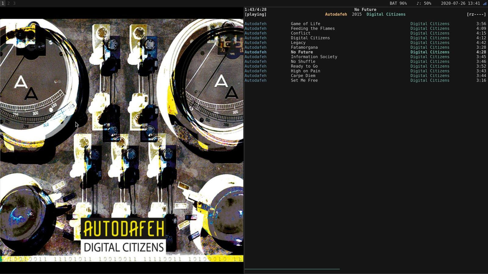

# mpd-art-box
A window displaying the cover for the currently playing MPD track - nothing more 


**Left:** mpd-art-box **Right:** [ncmpcpp](https://github.com/ncmpcpp/ncmpcpp)

## Installation
```
pip install mpd-art-box
```
